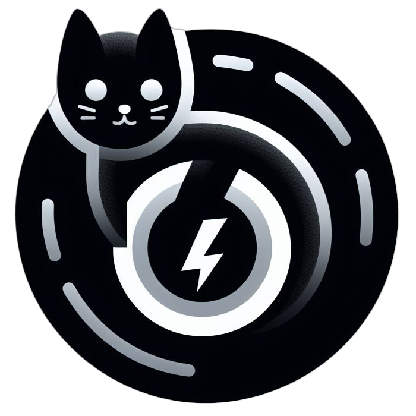

# CHARBON
___

**Charbon** est une application de chat basique, avec les fonctionnalités suivantes :

- Se connecter
- Rejoindre un salon
- Créer un salon
- Envoyer des messages
- Lire les messages en temps réel
___
Le but est d'implémenter les différentes routes API, définies dans le Swagger du backend, il y a des TODOs dans les hook, mais à vous d'implémenter les composants graphiques en conséquences.

- Supprimer un message
- Éditer un message
- Quitter ou supprimer un salon
- Supprimer un message en tant que créateur du salon
- Bannir un utilisateur en tant que créateur du salon

Il n'y a pas de test front pour le moment, libre à vous de les implémenter

Toute amélioration graphique est également bienvenue.